# 📱 Habitize

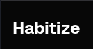

> A modern, intuitive habit-tracking web application built with Next.js, Supabase, and TypeScript

[](https://opensource.org/licenses/MIT)
[](https://www.typescriptlang.org/)
[](https://nextjs.org/)
[](https://supabase.com/)

## 🌟 Overview

Habitize is a comprehensive habit-tracking application that helps you build better daily routines. Track your habits, record memorable moments, and monitor your sleep patterns all in one beautiful, user-friendly interface.

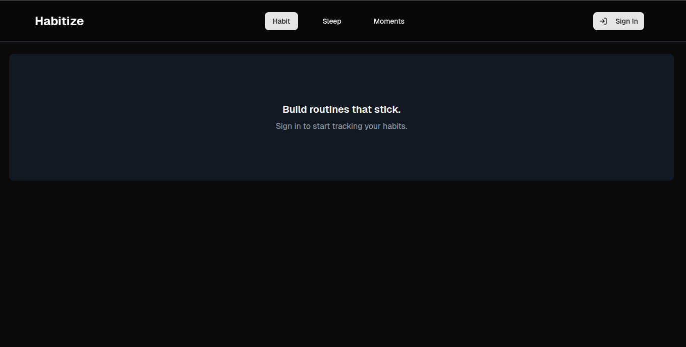

## ✨ Features

### 📝 Memorable Moments
Capture your daily highlights and reflections with a simple text note. Each day, record one meaningful moment that you want to remember.

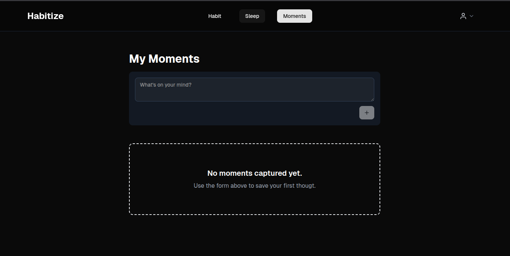

### 📊 Habit Grid
Create and track unlimited habits with an intuitive calendar-style grid interface. Simply click to toggle completion status for each day.

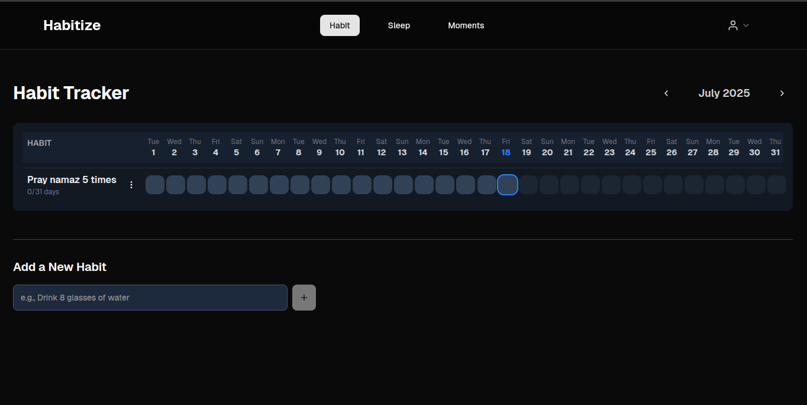

### 😴 Sleep Tracker
Log your sleep hours and visualize your sleep patterns with beautiful monthly charts. Understanding your sleep trends has never been easier.

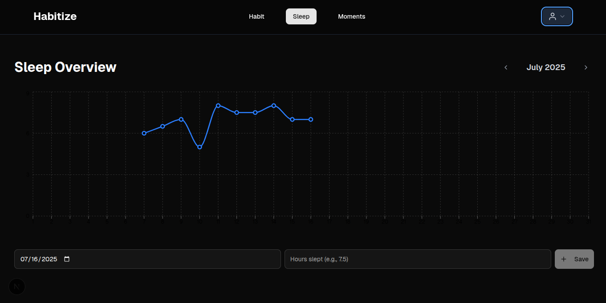

### 🔐 Secure Authentication
Full user authentication system with email/password login, ensuring your data remains private and secure.

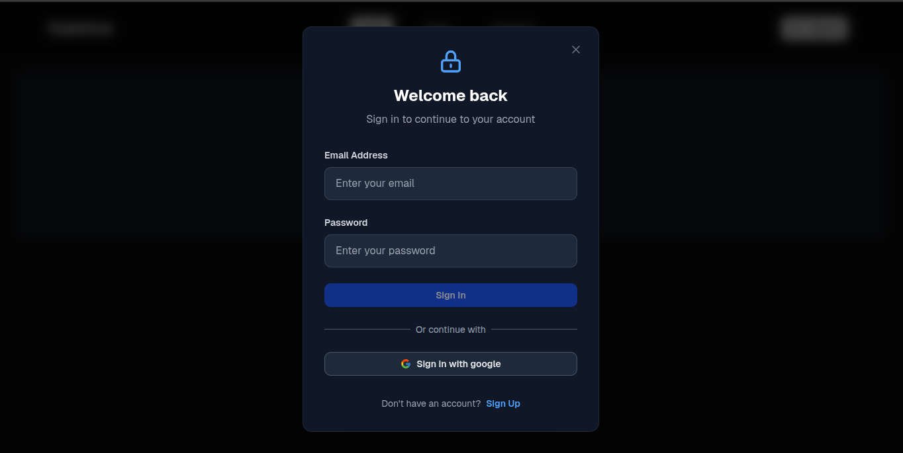

## 🛠️ Tech Stack

- **Frontend**: Next.js 15 (App Router), TypeScript, Tailwind CSS
- **UI Components**: shadcn/ui, Lucide React icons
- **Backend**: Supabase (PostgreSQL, Auth, RLS)
- **State Management**: React Context + Custom Hooks
- **Styling**: Tailwind CSS with custom components

## 📁 Project Structure

```
habitize/
├── app/                    # Next.js App Router pages & layouts
│   ├── (auth)/            # Authentication pages
│   ├── dashboard/         # Main app dashboard
│   └── globals.css        # Global styles
├── components/            # Reusable UI components
│   ├── ui/               # shadcn/ui components
│   ├── HabitGrid.tsx     # Habit tracking grid
│   ├── SleepChart.tsx    # Sleep visualization
│   └── Navbar.tsx        # Navigation component
├── context/              # React Context providers
│   ├── AuthContext.tsx   # Authentication context
│   └── SupabaseContext.tsx # Supabase client context
├── hooks/                # Custom React hooks
│   ├── useHabits.ts      # Habit management hook
│   ├── useMoment.ts      # Daily moments hook
│   └── useSleepLogs.ts   # Sleep tracking hook
├── lib/                  # Utilities and configurations
│   ├── supabase.ts       # Supabase client
│   └── utils.ts          # Helper functions
├── supabase/             # Database schema & migrations
│   ├── migrations/       # SQL migration files
│   └── schema.sql        # Database schema
├── store/                # Global state management (optional)
├── public/               # Static assets
│   └── images/           # App screenshots and assets
├── database.types.ts     # Generated TypeScript types
└── next.config.ts        # Next.js configuration
```

## 🗄️ Database Schema

The application uses the following Supabase tables with Row-Level Security (RLS) enabled:

- **`habits`**: User-defined habits
- **`habit_logs`**: Daily habit completion records
- **`memorable_moments`**: Daily memorable moment entries
- **`sleep_logs`**: Sleep duration tracking

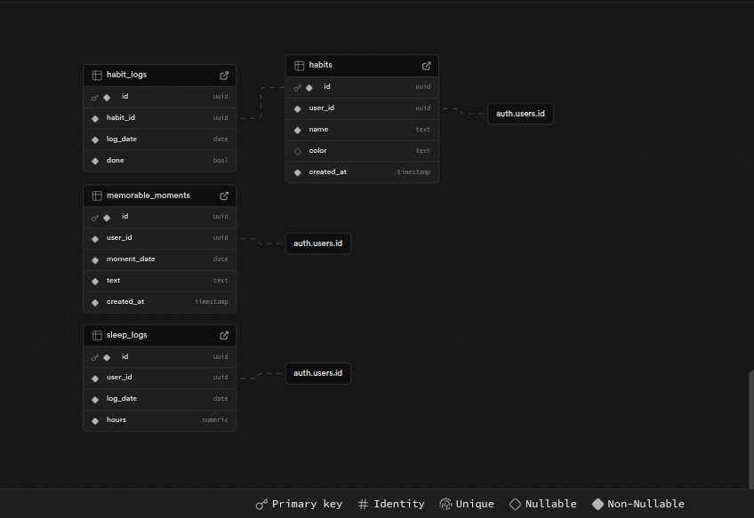

## 🎨 UI Components

Built with modern, accessible components using shadcn/ui:

- **Form Components**: Input fields, buttons, date pickers
- **Data Visualization**: Charts, grids, progress indicators
- **Navigation**: Responsive navbar, sidebar navigation
- **Feedback**: Toast notifications, loading states

## 📱 Mobile Responsiveness

Habitize is fully responsive and works seamlessly across all devices:

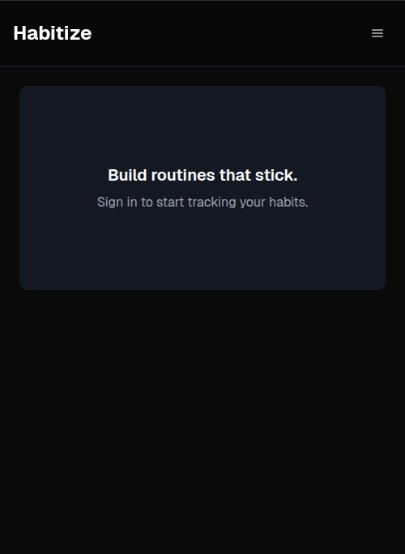
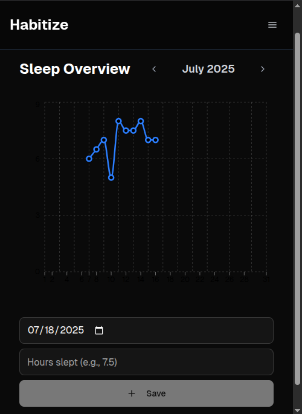
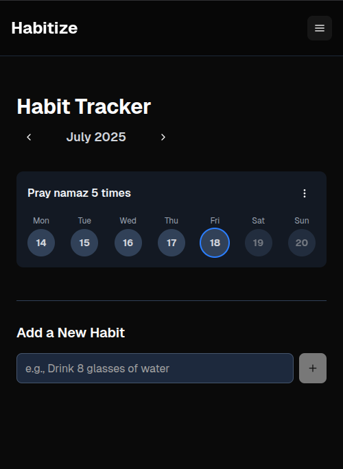

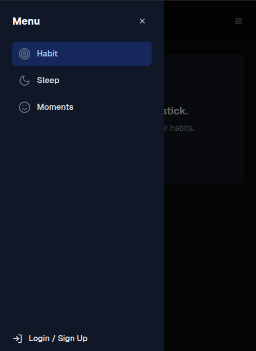

## 🤝 Contributing

We welcome contributions! Here's how to get started:

1. **Fork the repository**
2. **Create a feature branch**
   ```bash
   git checkout -b feature/amazing-feature
   ```
3. **Make your changes**
4. **Run tests and linting**
   ```bash
   npm run lint
   npm run type-check
   ```
5. **Commit your changes**
   ```bash
   git commit -m "feat: add amazing feature"
   ```
6. **Push to your branch**
   ```bash
   git push origin feature/amazing-feature
   ```
7. **Open a Pull Request**

### Contribution Guidelines

- Follow [Conventional Commits](https://www.conventionalcommits.org/) for commit messages
- Ensure all tests pass and code is properly linted
- Add appropriate documentation for new features
- Keep PRs focused and atomic

## 📝 License

This project is licensed under the MIT License - see the [LICENSE](LICENSE) file for details.

## 👨‍💻 Author

**Kashan Yunus** - [@kashan16](https://github.com/kashan16)

## 🙏 Acknowledgments

- [Next.js](https://nextjs.org/) for the amazing React framework
- [Supabase](https://supabase.com/) for the backend infrastructure
- [shadcn/ui](https://ui.shadcn.com/) for beautiful UI components
- [Tailwind CSS](https://tailwindcss.com/) for styling utilities
- [Lucide React](https://lucide.dev/) for the icon library

## 📞 Support

If you encounter any issues or have questions:

1. Check the [Issues](https://github.com/kashan16/habitize/issues) page
2. Create a new issue if your problem isn't already addressed
3. Join our [discussions](https://github.com/kashan16/habitize/discussions) for general questions

---

<div align="center">
  <strong>Built with ❤️ by Kashan Yunus</strong>
  <br>
  <em>Track your habits. Transform your life.</em>
</div>s